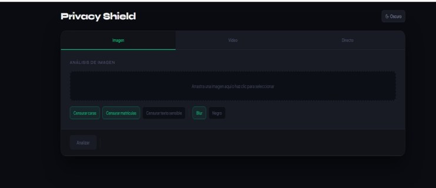
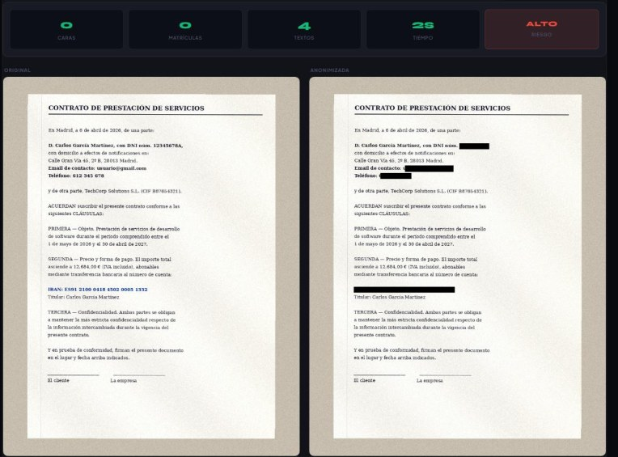

# Privacy Shield

Aplicación web que anonimiza de forma automática información sensible en **imágenes**, **vídeos** y **en directo desde la webcam**. Detecta caras, matrículas y datos personales en texto (DNI, IBAN, teléfono, email…) y los oculta con desenfoque gaussiano o relleno negro opaco.

Trabajo Fin de Grado del Grado en Tecnología Digital y Multimedia, Universitat Politècnica de València (curso 2025/2026).
Autor: Miguel Ángel González Caro · Tutor: José Manuel Giménez Guzmán.



## Qué hace

| Modo | Qué detecta | Detalles |
|---|---|---|
| **Imagen** | Caras, matrículas y texto sensible (OCR) | Devuelve la imagen anonimizada, estadísticas y un nivel de riesgo. Permite excluir caras concretas. |
| **Vídeo** | Caras y matrículas | Seguimiento de cada objeto con ByteTrack, detección de cambios de plano, conservación del audio y timeline de incidencias clicable. |
| **Directo** | Caras y matrículas | Procesa cada frame de la webcam en tiempo real (~100 ms de latencia) con relleno opaco. |

El módulo OCR reconoce formatos españoles: DNI, NIE, pasaporte, IBAN, tarjeta bancaria, teléfono fijo y móvil, email, URL, número de la Seguridad Social y matrícula.



## Resultados de los modelos

Los dos detectores son modelos propios entrenados con *fine-tuning* sobre **YOLO26n**. El modelo base de COCO no detectaba ninguna cara ni matrícula, porque no tiene esas clases.

| Modelo | Dataset | mAP@0.5 | Precisión | Recall |
|---|---|---|---|---|
| Caras (v2, 640 px) | 30 % de WIDER FACE | 0,644 | – | 0,570 |
| Matrículas | 10 % de License Plate Recognition (Roboflow) | 0,932 | 0,955 | 0,881 |

Pruebas hechas con una NVIDIA RTX 3050 Ti Laptop (4 GB).

## Arquitectura

```
frontend_web/  (HTML · CSS · JS, sin dependencias)
      │  fetch → API REST
      ▼
backend/       (Python · FastAPI)
  ├─ main.py          endpoints
  ├─ detector.py      carga de los modelos YOLO y detección en imagen
  ├─ video.py         procesado de vídeo por lotes + ByteTrack (BoxMOT) + FFmpeg
  ├─ ocr.py           EasyOCR + expresiones regulares para datos personales
  └─ anonimizador.py  desenfoque elíptico / rectangular y relleno negro
modelos/pesos/  pesos entrenados (caras.pt, matriculas.pt)
```

## Tecnologías

Python · FastAPI · Ultralytics YOLO26 · BoxMOT (ByteTrack) · EasyOCR · OpenCV · FFmpeg · HTML · CSS · JavaScript

## Cómo ejecutarlo

Requisitos: Python 3.11+, [FFmpeg](https://ffmpeg.org/) en el PATH y, recomendado, una GPU NVIDIA con CUDA.

```bash
git clone https://github.com/miiguelg13/privacy-shield.git
cd privacy-shield/backend

python -m venv venv
# Windows: venv\Scripts\activate    ·    Linux/macOS: source venv/bin/activate
pip install -r requirements.txt --extra-index-url https://download.pytorch.org/whl/cu124

uvicorn main:app --reload --port 8000
```

En otra terminal, sirve el frontend en el puerto 3000:

```bash
cd frontend_web
python -m http.server 3000
```

Abre <http://localhost:3000>.

> Sin GPU, instala la versión de PyTorch para CPU (quita `+cu124` de `torch`, `torchvision` y `torchaudio` en `requirements.txt`). El procesado de vídeo será bastante más lento.

## Reentrenar los modelos

Los scripts `backend/entrenamiento_caras.py` y `backend/entrenamiento_matriculas.py` esperan los datasets en `datasets/wider_face/` y `datasets/matriculas/` (formato YOLO, con su `data.yaml`). Los datasets no se incluyen en el repositorio por su tamaño.

## Limitaciones conocidas

- En vídeos de baja calidad con caras muy pequeñas se pueden perder detecciones de fondo.
- El OCR no reconoce texto manuscrito de forma fiable.
- Un vídeo largo con muchas caras y desenfoque gaussiano puede tardar bastante en procesarse.
